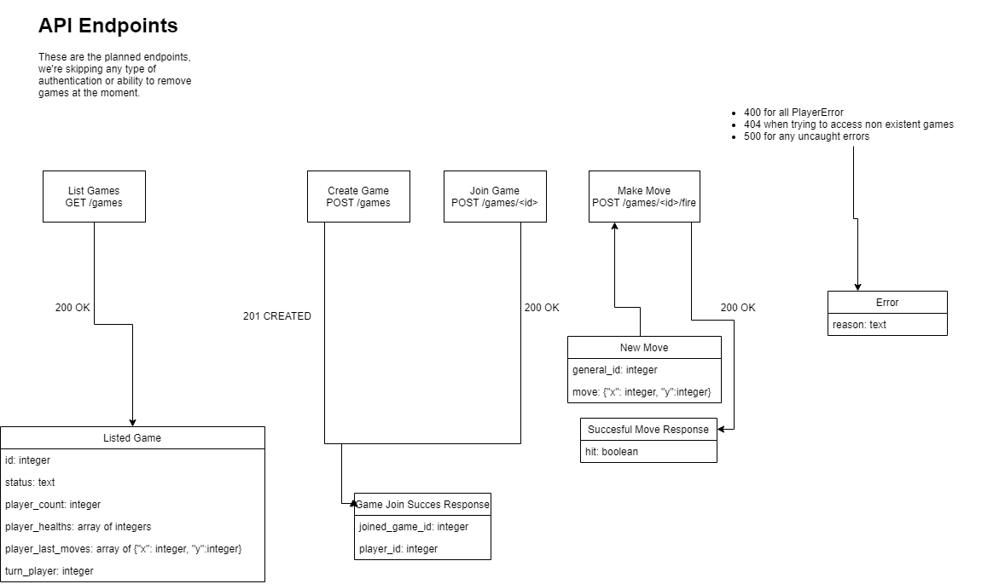

# BattleShip-RESTful
Challenge to make a playable battleship through a REST API in 4 hours

# Understanding the game rules
There is only a small amount of rules in battleship.
I've by quickly coding up a prototype adjusted the rules so it essentially plays the same. But it's easier to write logic against.

Here we will first get snippets of the rules, followed by -> showing what I made out of that.

---

Both players place down their ships
    - The ships cannot overlap
    - The ships cannot go out of bounds

->

Ships are preplaced in hardcoded locations according to the rules above.
We pre-place the ships to make time constraints.

---

Once the ships are placed the players take turns specifying a target,
the opposite player in that case will tell them if they hit or missed.
The opposite player will also place a peg in the hit ship in the square
that corresponds with the hit.

->

players take turns to check a hit on the opponent's board.
If a hit was made the ship square associated with that hit will be removed

- Moves cannot go out of bounds

---

If one player has all their ships' peg holes filled, they lose and the game ends

->

If one player has ran out of ship squares they lose and the game ends

# Database

To make this game work in a restful manner I've decided to serialize each game to a database entry.
Each of the instance's fields will be converted to a database column.

The player boards will be serialized to a jsonfield that just contains the the array directly.
Instances of BattleShipPlayerBoard will be converted to hashes with the same fields.

This is to reduce needless complexity in database relations.

# API Endpoints
These API Endpoints are derived from the the game logic classes I wrote:

New Move names a field 'general_id', should be 'player_id'

# Technology plan

Python3 language
libraries:
- flask: For server
- flask_restful: For easier endpoint definition and some shortcut functions
- peewee: For sqlite database orm (Using playhouse extensions)
- Pocha: For test framework
- Hamcrest: For expressive matchers in tests.
